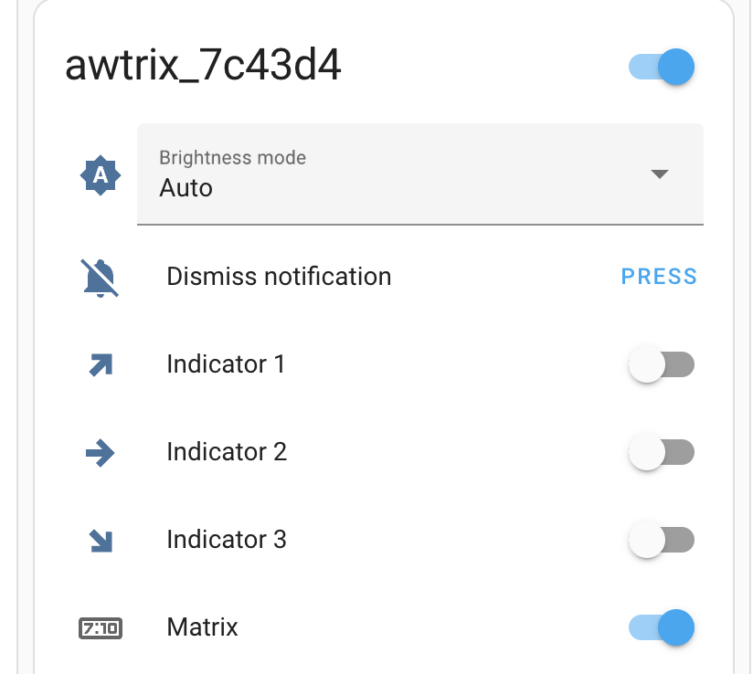

# homeassistant-custom_components-awtrix
HASS awtrix 

# notify.yaml

```
- name: awtrix_bedroom
  platform: awtrix
  device: awtrix_7c43d4

- name: awtrix_hall
  platform: awtrix
  device: awtrix_diy
```



